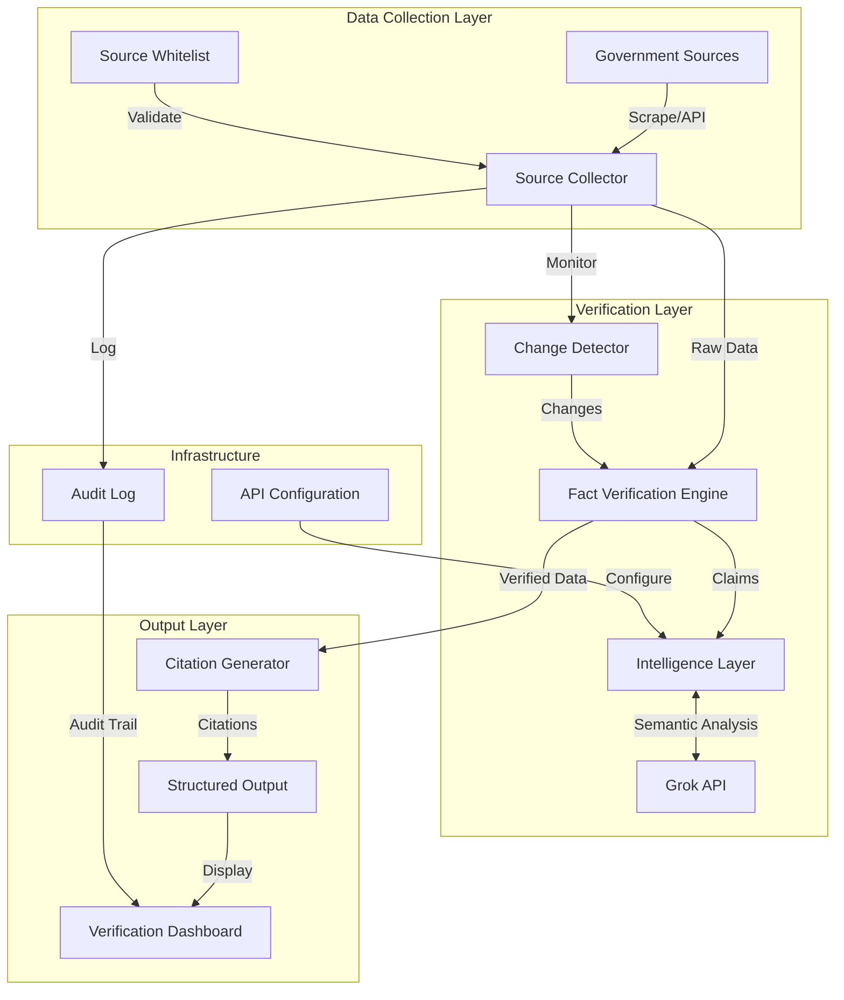
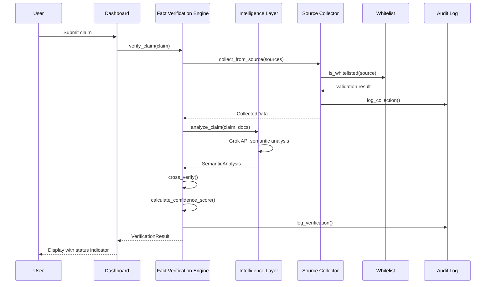

# Design Document: VeriGov AI

## Overview

VeriGov AI is an official-source-only verification platform that ensures information integrity through strict source validation, AI-powered fact verification, and complete traceability. The system architecture follows a modular pipeline design: **Collect → Verify → Structure → Deliver**.

The platform exclusively collects data from whitelisted government sources, validates claims using the Grok API for semantic analysis, detects policy changes in real-time, and delivers structured intelligence with transparent citations. Every piece of information is traceable to its official source, and every claim receives a confidence score based on multi-authority cross-verification.

### Key Design Principles

1. **Zero Unofficial Sources**: Strict whitelist-based collection with rule-based trust filtering
2. **Verification-First**: Every claim must be verified before delivery
3. **Complete Traceability**: Immutable audit logs for all operations
4. **Modular Architecture**: Independent, testable components with clear interfaces
5. **Fail-Safe Design**: Unverified information is clearly marked; system never presents unverified claims as verified

## Architecture

### High-Level Architecture



### Component Architecture

The system is organized into six primary modules:

1. **Source Collection Module**: Handles whitelisted data collection from government sources
2. **Verification Module**: Performs claim validation and confidence scoring
3. **Intelligence Module**: Provides AI-powered semantic analysis via Grok API
4. **Change Detection Module**: Monitors and identifies policy updates
5. **Output Module**: Generates structured intelligence with citations
6. **Infrastructure Module**: Manages configuration, logging, and audit trails

## Components and Interfaces

### 1. Source Collector

**Purpose**: Collect data exclusively from whitelisted government sources with continuous monitoring.

**Responsibilities**:
- Validate all sources against the whitelist before collection
- Scrape content from verified government domains
- Integrate with official government APIs
- Extract metadata (publication date, source domain, document URL, timestamp)
- Log all collection activities to the audit log
- Implement continuous monitoring for new information

**Interface**:
```python
class SourceCollector:
    def __init__(self, whitelist: SourceWhitelist, audit_log: AuditLog):
        """Initialize with whitelist and audit log dependencies."""
        
    def collect_from_source(self, source_url: str) -> CollectedData:
        """
        Collect data from a single source.
        
        Validates source against whitelist, collects content,
        and logs the operation.
        
        Raises:
            UnauthorizedSourceError: If source not in whitelist
            CollectionError: If collection fails
        """
        
    def collect_all(self) -> List[CollectedData]:
        """
        Collect from all whitelisted sources.
        
        Returns list of collected data, continues on individual failures.
        """
        
    def monitor_sources(self) -> Iterator[CollectedData]:
        """
        Continuously monitor sources for new content.
        
        Yields new data as it becomes available.
        """
```

**Data Structures**:
```python
@dataclass
class CollectedData:
    content: str
    source_domain: str
    document_url: str
    publication_date: datetime
    collection_timestamp: datetime
    content_hash: str
    metadata: Dict[str, Any]
```

### 2. Source Whitelist

**Purpose**: Maintain and validate the list of approved government sources.

**Responsibilities**:
- Store verified government domains with validation rules
- Validate source authenticity (SSL certificates, domain verification)
- Require manual approval for new sources
- Provide rule-based trust filtering

**Interface**:
```python
class SourceWhitelist:
    def is_whitelisted(self, source_url: str) -> bool:
        """Check if source is in whitelist."""
        
    def validate_source(self, source_url: str) -> ValidationResult:
        """
        Validate source authenticity.
        
        Checks SSL certificate, domain authenticity, and validation rules.
        """
        
    def add_source(self, source_url: str, validation_rules: Dict) -> bool:
        """
        Add new source to whitelist (requires manual approval).
        
        Returns True if added, False if rejected.
        """
        
    def get_all_sources(self) -> List[WhitelistedSource]:
        """Return all whitelisted sources."""
```

**Data Structures**:
```python
@dataclass
class WhitelistedSource:
    domain: str
    source_type: str  # 'web_scrape' or 'api'
    validation_rules: Dict[str, Any]
    added_date: datetime
    approved_by: str
```

### 3. Fact Verification Engine

**Purpose**: Core verification component that validates claims against official documents.

**Responsibilities**:
- Match claims against official documents
- Perform timeline-based validation
- Implement multi-authority cross-verification
- Generate confidence scores (0-100)
- Categorize results (Verified, Partially Verified, Incorrect)
- Flag unverified claims instantly

**Interface**:
```python
class FactVerificationEngine:
    def __init__(self, intelligence_layer: IntelligenceLayer, 
                 audit_log: AuditLog):
        """Initialize with intelligence layer and audit log."""
        
    def verify_claim(self, claim: str, 
                     context: Optional[Dict] = None) -> VerificationResult:
        """
        Verify a single claim against official sources.
        
        Performs semantic matching, timeline validation, and
        multi-authority cross-verification.
        """
        
    def verify_batch(self, claims: List[str]) -> List[VerificationResult]:
        """Verify multiple claims efficiently."""
        
    def cross_verify(self, claim: str, 
                     sources: List[CollectedData]) -> CrossVerificationResult:
        """
        Verify claim across multiple government sources.
        
        Returns aggregated verification with confidence score.
        """
```

**Data Structures**:
```python
@dataclass
class VerificationResult:
    claim: str
    status: VerificationStatus  # VERIFIED, PARTIALLY_VERIFIED, INCORRECT, UNVERIFIED
    confidence_score: float  # 0-100
    supporting_sources: List[str]
    conflicting_sources: List[str]
    timeline_validation: Optional[TimelineValidation]
    reasoning: str
    verification_timestamp: datetime

@dataclass
class TimelineValidation:
    claim_date: Optional[datetime]
    source_dates: List[datetime]
    is_current: bool
    superseded_by: Optional[str]
```

### 4. Intelligence Layer

**Purpose**: Provide AI-powered semantic analysis using Grok API.

**Responsibilities**:
- Send claims to Grok API for semantic analysis
- Extract key entities, dates, and policy references
- Provide context-aware analysis of government terminology
- Handle rate limiting and retries
- Validate API responses

**Interface**:
```python
class IntelligenceLayer:
    def __init__(self, api_config: APIConfiguration):
        """Initialize with API configuration."""
        
    def analyze_claim(self, claim: str, 
                      official_docs: List[CollectedData]) -> SemanticAnalysis:
        """
        Analyze claim semantically against official documents.
        
        Uses Grok API to understand context, extract entities,
        and identify relevant policy references.
        """
        
    def extract_entities(self, text: str) -> List[Entity]:
        """Extract key entities (people, organizations, dates, policies)."""
        
    def compare_statements(self, claim: str, 
                          official_statement: str) -> ComparisonResult:
        """
        Compare claim against official statement semantically.
        
        Returns similarity score and identified differences.
        """
```

**Data Structures**:
```python
@dataclass
class SemanticAnalysis:
    claim: str
    entities: List[Entity]
    policy_references: List[str]
    key_dates: List[datetime]
    context: str
    semantic_matches: List[SemanticMatch]
    confidence: float

@dataclass
class Entity:
    text: str
    entity_type: str  # PERSON, ORGANIZATION, POLICY, DATE, LOCATION
    relevance_score: float

@dataclass
class SemanticMatch:
    official_text: str
    source_url: str
    similarity_score: float
    matching_context: str
```


### 5. Change Detector

**Purpose**: Monitor government sources for policy updates and changes.

**Responsibilities**:
- Continuously monitor whitelisted sources
- Identify policy modifications and amendments
- Detect conflicting statements across sources
- Flag outdated information
- Generate real-time alerts
- Maintain version history

**Interface**:
```python
class ChangeDetector:
    def __init__(self, source_collector: SourceCollector, 
                 audit_log: AuditLog):
        """Initialize with source collector and audit log."""
        
    def detect_changes(self, source_url: str) -> List[DetectedChange]:
        """
        Detect changes in a specific source.
        
        Compares current content with historical versions.
        """
        
    def monitor_all_sources(self) -> Iterator[DetectedChange]:
        """
        Continuously monitor all sources for changes.
        
        Yields changes as they are detected.
        """
        
    def detect_conflicts(self, topic: str) -> List[Conflict]:
        """
        Detect conflicting statements across sources on a topic.
        """
        
    def flag_outdated(self, content: CollectedData) -> Optional[OutdatedFlag]:
        """
        Check if content is outdated based on superseding documents.
        """
```

**Data Structures**:
```python
@dataclass
class DetectedChange:
    source_url: str
    change_type: ChangeType  # POLICY_UPDATE, LAW_AMENDMENT, CORRECTION, NEW_DOCUMENT
    old_content: Optional[str]
    new_content: str
    detected_timestamp: datetime
    impact_level: str  # HIGH, MEDIUM, LOW
    summary: str

@dataclass
class Conflict:
    topic: str
    conflicting_sources: List[str]
    statements: List[str]
    detected_timestamp: datetime
    resolution_status: str  # UNRESOLVED, RESOLVED, INVESTIGATING
```

### 6. Citation Generator

**Purpose**: Create transparent claim-to-source mappings with official links.

**Responsibilities**:
- Generate properly formatted citations
- Map claims to supporting sources
- Provide official source links
- Create audit trails for verification process
- Explain confidence score factors

**Interface**:
```python
class CitationGenerator:
    def generate_citation(self, source: CollectedData) -> Citation:
        """
        Generate formatted citation for a source.
        
        Includes document title, URL, access date, and government authority.
        """
        
    def map_claim_to_sources(self, 
                            verification: VerificationResult) -> ClaimSourceMap:
        """
        Create transparent mapping between claim and supporting sources.
        """
        
    def explain_verification(self, 
                            verification: VerificationResult) -> VerificationExplanation:
        """
        Generate human-readable explanation of verification process.
        
        Includes methodology, sources checked, and confidence factors.
        """
```

**Data Structures**:
```python
@dataclass
class Citation:
    document_title: str
    source_url: str
    government_authority: str
    publication_date: datetime
    access_date: datetime
    citation_format: str  # Formatted citation string

@dataclass
class ClaimSourceMap:
    claim: str
    supporting_citations: List[Citation]
    conflicting_citations: List[Citation]
    verification_methodology: str

@dataclass
class VerificationExplanation:
    claim: str
    verification_status: str
    confidence_score: float
    confidence_factors: List[str]
    sources_checked: List[str]
    methodology: str
    limitations: Optional[str]
```

### 7. Structured Output Generator

**Purpose**: Format verified information into structured intelligence reports.

**Responsibilities**:
- Generate clear summaries of complex policies
- Create policy change comparisons
- Produce impact analysis
- Format timeline tracking
- Support multiple output formats (JSON, Markdown, structured reports)
- Include verification status and confidence scores

**Interface**:
```python
class StructuredOutputGenerator:
    def __init__(self, citation_generator: CitationGenerator):
        """Initialize with citation generator."""
        
    def generate_summary(self, 
                        verified_data: List[VerificationResult]) -> PolicySummary:
        """
        Generate clear summary of complex policies.
        
        Simplifies technical language while maintaining accuracy.
        """
        
    def generate_change_report(self, 
                               changes: List[DetectedChange]) -> ChangeReport:
        """
        Create side-by-side comparison of policy changes.
        
        Includes impact analysis and timeline.
        """
        
    def generate_timeline(self, topic: str, 
                         data: List[CollectedData]) -> Timeline:
        """
        Create timeline showing policy evolution.
        """
        
    def format_output(self, content: Any, 
                     format_type: OutputFormat) -> str:
        """
        Format content in specified format (JSON, Markdown, etc.).
        """
```

**Data Structures**:
```python
@dataclass
class PolicySummary:
    title: str
    summary: str
    key_points: List[str]
    verification_status: VerificationStatus
    confidence_score: float
    sources: List[Citation]
    last_updated: datetime

@dataclass
class ChangeReport:
    title: str
    old_version: str
    new_version: str
    changes: List[str]
    impact_analysis: str
    effective_date: Optional[datetime]
    sources: List[Citation]

@dataclass
class Timeline:
    topic: str
    events: List[TimelineEvent]
    sources: List[Citation]

@dataclass
class TimelineEvent:
    date: datetime
    event_type: str
    description: str
    source_url: str
```

### 8. Verification Dashboard

**Purpose**: Provide user-friendly interface for viewing verification results.

**Responsibilities**:
- Display verification status with clear indicators (✓ ⚠ ✗)
- Show confidence scores and supporting sources
- Provide real-time updates
- Display misinformation warnings
- Allow filtering and drill-down views
- Show complete verification process

**Interface**:
```python
class VerificationDashboard:
    def __init__(self, output_generator: StructuredOutputGenerator,
                 audit_log: AuditLog):
        """Initialize with output generator and audit log."""
        
    def display_verification(self, 
                            verification: VerificationResult) -> DashboardView:
        """
        Create dashboard view for verification result.
        
        Includes status indicator, confidence score, sources, and drill-down.
        """
        
    def display_batch_results(self, 
                             results: List[VerificationResult]) -> BatchDashboardView:
        """
        Display multiple verification results with filtering.
        """
        
    def get_audit_trail(self, claim: str) -> AuditTrail:
        """
        Retrieve complete audit trail for a claim.
        """
```

**Data Structures**:
```python
@dataclass
class DashboardView:
    claim: str
    status_indicator: str  # "✓ Verified", "⚠ Partially Verified", "✗ Incorrect"
    confidence_score: float
    summary: str
    supporting_sources: List[Citation]
    verification_details: VerificationExplanation
    warnings: List[str]
    last_updated: datetime
```

### 9. API Configuration

**Purpose**: Manage API credentials and connection settings securely.

**Responsibilities**:
- Load API keys from environment variables or secure storage
- Validate configuration before use
- Never expose credentials in logs
- Support multiple API endpoints
- Manage government API credentials

**Interface**:
```python
class APIConfiguration:
    def __init__(self, config_source: str = "env"):
        """Initialize from environment or config file."""
        
    def get_grok_api_key(self) -> str:
        """
        Retrieve Grok API key.
        
        Raises:
            ConfigurationError: If key is missing or invalid
        """
        
    def get_government_api_credentials(self, 
                                      api_name: str) -> Dict[str, str]:
        """
        Retrieve credentials for government API.
        """
        
    def validate_configuration(self) -> ValidationResult:
        """
        Validate all configuration settings.
        
        Checks for required keys and valid formats.
        """
```

### 10. Audit Log

**Purpose**: Provide immutable, complete traceability for all system operations.

**Responsibilities**:
- Record all data collection events
- Log verification activities
- Track configuration changes
- Provide audit trail for compliance
- Support querying and filtering

**Interface**:
```python
class AuditLog:
    def log_collection(self, source: str, content_hash: str, 
                      timestamp: datetime) -> None:
        """Log data collection event."""
        
    def log_verification(self, claim: str, result: VerificationResult, 
                        timestamp: datetime) -> None:
        """Log verification activity."""
        
    def log_unauthorized_attempt(self, source: str, 
                                timestamp: datetime) -> None:
        """Log attempted access to non-whitelisted source."""
        
    def query_logs(self, filters: Dict[str, Any]) -> List[AuditEntry]:
        """Query audit logs with filters."""
        
    def get_audit_trail(self, claim: str) -> List[AuditEntry]:
        """Get complete audit trail for a specific claim."""
```

**Data Structures**:
```python
@dataclass
class AuditEntry:
    entry_id: str
    timestamp: datetime
    event_type: str  # COLLECTION, VERIFICATION, CONFIG_CHANGE, UNAUTHORIZED_ATTEMPT
    details: Dict[str, Any]
    user: Optional[str]
    source: Optional[str]
```

## Data Models

### Core Data Flow



### Data Validation Rules

1. **Source Validation**:
   - All sources must be in whitelist before collection
   - SSL certificate must be valid
   - Domain must match whitelist entry exactly

2. **Verification Validation**:
   - Confidence score must be 0-100
   - Status must be one of: VERIFIED, PARTIALLY_VERIFIED, INCORRECT, UNVERIFIED
   - At least one source must be checked for verification

3. **Citation Validation**:
   - All citations must include: title, URL, authority, dates
   - URLs must be from whitelisted domains
   - Access date must not be in the future

4. **Audit Log Validation**:
   - All entries must be immutable (append-only)
   - Timestamps must be in UTC
   - Entry IDs must be unique

